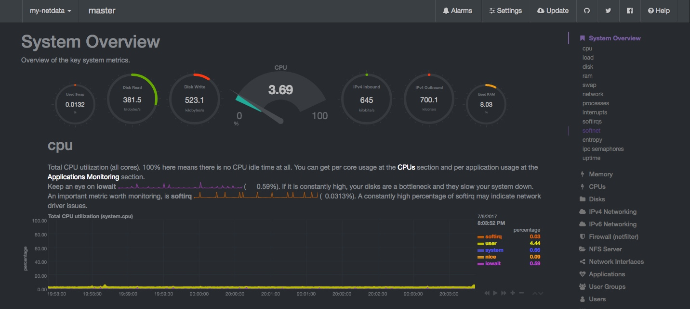

# Web Monitoring

System performace visulization. 

## Getting Started

Gnaglia and netdata are well used opensource software for  system performance visulization tool in linux based batch systems. 

 

Ganglia is a scalable distributed monitoring system. It scales well with very large numbers of servers and is useful for viewing performance metrics in near real-time.

Netdata provides accurate performance monitoring through extensible web dashboards that visualize the processes and services on your Linux systems. It monitors metrics about CPU, memory, disks, networks, processes, and more.

### Prerequisites

OS: CentOS 6.8

For Ganglia installation digitalocean tutorial is best

* [Digital_Ocean](https://www.digitalocean.com/community/tutorials/introduction-to-ganglia-on-ubuntu-14-04)

For Netdata installation digitalocean tutorial is awesome

* [Digital_Ocean](https://www.digitalocean.com/community/tutorials/how-to-set-up-real-time-performance-monitoring-with-netdata-on-ubuntu-16-04)

Nginx reverse proxy to connect to backend ganglia and netdata

### Installing

Run ```./install.sh ``` script 

Do some manual input during ```letsencrypt``` installation 


```
How would you like to authenticate with the ACME CA?
-------------------------------------------------------------------------------
1: Spin up a temporary webserver (standalone)
2: Place files in webroot directory (webroot)
-------------------------------------------------------------------------------
Select the appropriate number [1-2] then [enter] (press 'c' to cancel): 1
Enter email address (used for urgent renewal and security notices) (Enter 'c' to
cancel): 1 
```

```
-------------------------------------------------------------------------------
Please read the Terms of Service at
https://letsencrypt.org/documents/LE-SA-v1.1.1-August-1-2016.pdf. You must agree
in order to register with the ACME server at
https://acme-v01.api.letsencrypt.org/directory
-------------------------------------------------------------------------------
(A)gree/(C)ancel: A
```
```
-------------------------------------------------------------------------------
Would you be willing to share your email address with the Electronic Frontier
Foundation, a founding partner of the Let's Encrypt project and the non-profit
organization that develops Certbot? We'd like to send you email about EFF and
our work to encrypt the web, protect its users and defend digital rights.
-------------------------------------------------------------------------------
(Y)es/(N)o: <depends on you >
```
``Please enter in your domain name(s) (comma and/or space separated)  (Enter 'c'
to cancel): <hostname.domain>``

### Security setup 

SSL Configuration 

Copy the ``nginx.conf`` to ``/etc/nginx/config.d/``

Replace <hostname.domain> with what you input during the above installation 

ssl_certificate /etc/letsencrypt/live/``<hostname.domain>``/fullchain.pem;  
ssl_certificate_key /etc/letsencrypt/live/`<hostname.domain>`/privkey.pem

Generate Strong Diffie-Hellman Group,to generate a 2048-bit group, use this command:

``sudo openssl dhparam -out /etc/ssl/certs/dhparam.pem 2048``


Password authentication with Nginx

``htpasswd /etc/nginx/.htpasswd <user_name>`` 


To protect from bruteforce configure fail2ban 

Enable nginx part in ``/etc/fail2ban/jain.conf``

```
[nginx-http-auth]
enabled  = true
filter   = nginx-http-auth
port     = http,https
logpath  = /var/log/nginx/error.log
```
  
 
* [Digital_Ocean](https://www.digitalocean.com/community/tutorials/how-to-protect-an-nginx-server-with-fail2ban-on-ubuntu-14-04)


### Testing 

``service nginx httpd start``

For Ganglia

   ``curl http://127.0.0.1:8000``

For Netdata

   ``curl http://127.0.0.1:19999``
   
Certificate check  

  ``openssl s_client -connect <hostname.domain>:443`` 


